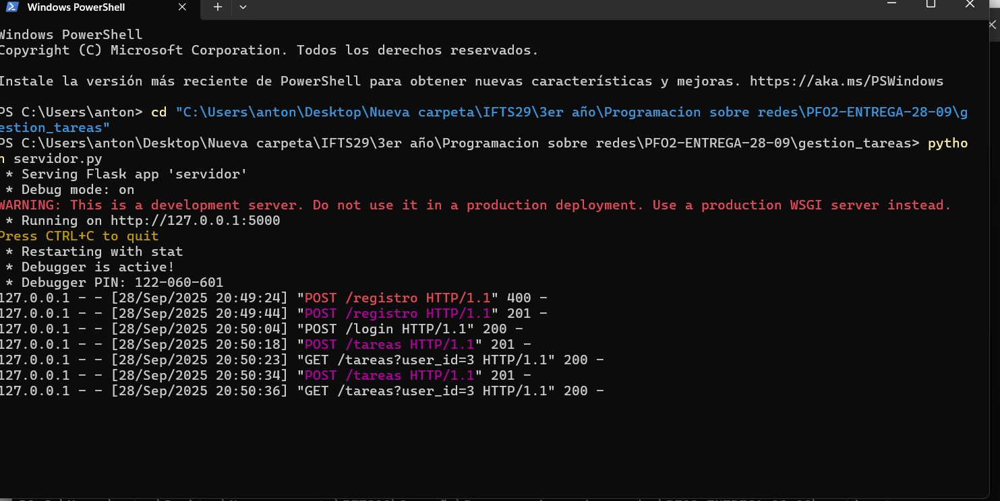
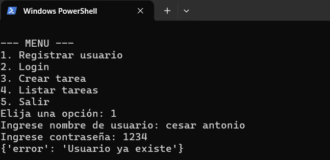
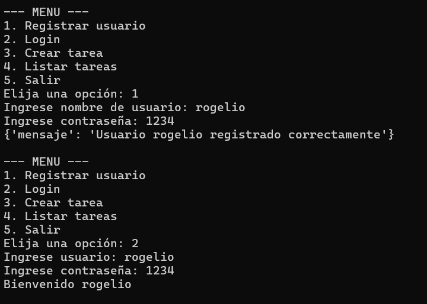
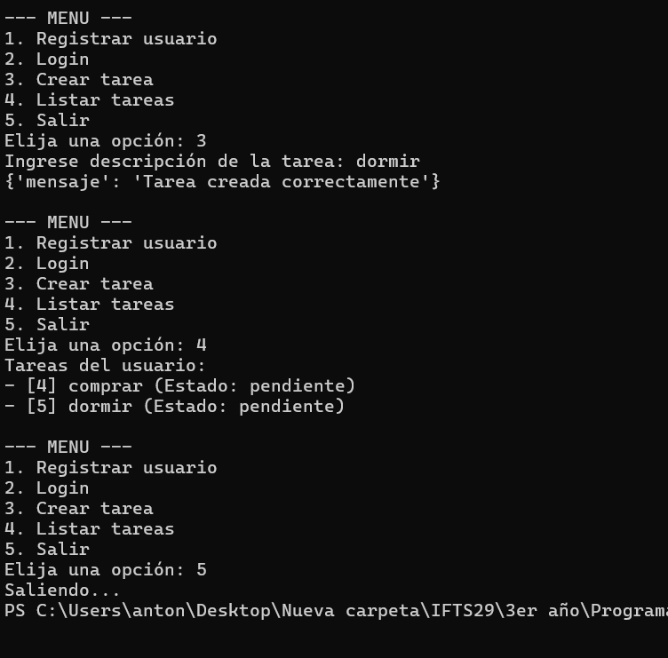

# Sistema de Gestión de Tareas

Proyecto desarrollado en Python con **Flask** y **SQLite** para gestionar usuarios y tareas.

---

## 🔹 Requisitos

- Python 3.13 o superior
- Librerías Python:
  ```bash
  pip install flask requests bcrypt
🔹 Archivos del proyecto
servidor.py → API Flask con endpoints para registro, login y manejo de tareas.

cliente.py → Cliente de consola para interactuar con la API.

tareas.db → Base de datos SQLite con usuarios y tareas.

README.md → Documentación del proyecto.

🔹 Cómo ejecutar
Abrir una terminal en la carpeta del proyecto.

Ejecutar el servidor:

bash
Copiar código
python servidor.py
El servidor correrá en http://127.0.0.1:5000.

Abrir otra terminal en la misma carpeta.

Ejecutar el cliente:

bash
Copiar código
python cliente.py
Usar el menú para:

Registrar usuario

Login

Crear tareas

Listar tareas

Salir

## 🔹 Capturas de pantalla

### Servidor - GET / POST


### Usuario ya existe


### Registro y Login


### Crear y Listar Tareas



🔹 Conceptos importantes
¿Por qué hashear contraseñas?
Para proteger la información de los usuarios.

Evita que alguien con acceso a la base de datos pueda leer las contraseñas en texto plano.

Incluso si la base de datos se filtra, las contraseñas hasheadas no son directamente utilizables.

Ventajas de usar SQLite en este proyecto
Es ligero y fácil de usar: no requiere instalar un servidor de base de datos.

Ideal para proyectos pequeños y pruebas locales.

Los datos se almacenan en un archivo único, fácil de manejar y compartir.